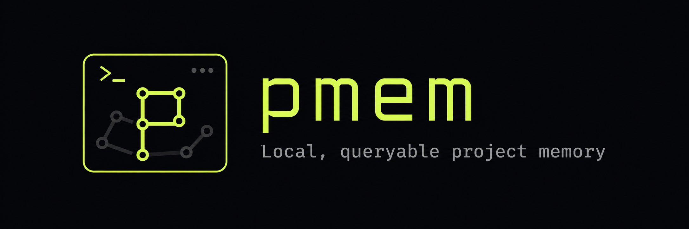

<p align="center">
  
</p>

# pmem — Project Memory for AI Agents

[](https://www.npmjs.com/package/pmem-ai)
[](LICENSE)
[](https://nodejs.org)

`pmem` is a local CLI runtime that gives AI coding agents persistent, queryable project memory. It stores memory as Markdown cards under `.pmem/` and rebuilds SQLite indexes for fast, token-efficient recall — so agents remember where the project is, what changed, what matters next, and why.

## Why pmem

Coding agents lose project context every session. A repository has source files, docs, decisions, tasks, and traces — but the agent usually re-discovers all of it from scratch.

pmem adds a small, explicit memory layer to the project:

| Your Need | pmem Command |
|---|---|
| Restore project context across sessions | `pmem recall --budget 2000` |
| Auto-detect code changes and sync memory | `pmem capture --auto` / `pmem sync` |
| Find relevant memory cards | `pmem ask "<query>"` |
| Discover codebase relationships | `pmem discover` |
| Verify memory integrity | `pmem verify` |
| Install agent rules (AGENTS.md, Cursor, etc.) | `pmem install --agent-rules` |

The design is intentionally **local and Git-friendly**. Markdown cards are the source of truth. SQLite is a rebuildable runtime index — not a separate knowledge base. No cloud services, no vector DBs, no lock-in.

It is **not** a vector database, MCP server platform, graph UI, or remote multi-user service. v0.8 added the **Hybrid Recall Engine**: deterministic multi-channel retrieval across exact IDs, aliases, tags, source file paths, always-on FTS5/BM25, and graph expansion — with recency scoring, stale/dirty penalties, and explainable output.

**v1.1 (current)** ships **System Memory Security**: namespace hierarchy, capability ACL with 12 capabilities, agent quotas, memory poisoning defense, trust-aware recall scoring, and secret-sensitivity filtering — all built on the v1.0 two-layer architecture.

## Who It's For

- You use AI coding agents (Claude Code, Codex, Cursor, Cline, Aider, Windsurf, Gemini CLI)
- Your project has decisions and context that should survive across sessions
- You want agents to update memory deliberately — not auto-write noisy logs
- You prefer local, version-controlled files over hosted memory services

## Install

```bash
npm install -g pmem-ai
pmem --version
```

Requires Node.js ≥ 18. `better-sqlite3` is compiled during install.

Run `pmem doctor` anytime to check the health of your project memory setup.

### From Source

```bash
git clone https://github.com/KkSss999/pmem.git
cd pmem
npm install
npm run build
npm link
```

### Installing Agent Skills

After installing the CLI, add pmem skills to your agent so it knows how to use pmem:

```bash
pmem install --skills --claude    # → ~/.claude/skills/pmem/
pmem install --skills --codex     # → ~/.codex/skills/pmem/
pmem install --skills --gemini    # → ~/.gemini/skills/pmem/
pmem install --skills --all       # → all detected agents
```

Run the command for each agent you use. Each install copies the packaged `skills/pmem/` directory — including `SKILL.md` and reference guides — into that agent's global skills folder.

Verify installed skill files:

```bash
test -f ~/.claude/skills/pmem/SKILL.md
test -f ~/.codex/skills/pmem/SKILL.md
test -f ~/.gemini/skills/pmem/SKILL.md
```

## Quick Start

### 5-Minute Setup

```bash
pmem init my-project
pmem rebuild
pmem context "Implement core setup"
pmem capture --auto
```

For a richer guided setup:

```bash
pmem init my-project --guided
```

### Adding Memory Cards

Add a module card that points at source files:

```bash
mkdir -p .pmem/modules src

cat > .pmem/modules/core.md <<'EOF'
---
id: module.core
type: module
status: active
tags: [core]
source_files: [src/index.ts]
---

# Core

## Purpose
Main project entry point.
EOF

echo "export const value = 1;" > src/index.ts
pmem rebuild
pmem ask "core" --format compact
```

### Tracking Changes

Make a code change and let pmem identify the affected memory:

```bash
echo "export const value = 2;" > src/index.ts
pmem status --format json
pmem mark-dirty --auto
pmem update --suggest --format json
pmem update --confirm -s "Updated core module" -n "Continue development"
pmem verify
```

> **Note:** `pmem update --suggest` outputs suggestions in JSON. Agents should check `summary.has_actionable` to decide next steps.

### Cross-Session Recall

pmem's value shines when you come back. Open a new terminal or start a new agent session the next day:

```bash
pmem session start -a "Claude"
pmem recall --format compact --budget 2000
```

Output:

```
PROJECT: my-project
STAGE: Active development
FOCUS: Updated core module
NEXT: Continue development
STATE:
  - Core module value updated to 2
READ_IF_NEEDED:
  .pmem/state.md
  .pmem/next.md
  .pmem/modules/core.md
```

In one command you restored project context, last state, and what to read next — without re-reading all source files or asking "where were we?"

### Agent-Native Init (for scripts and CI)

For agents and scripts that can't answer TTY prompts:

```bash
pmem init my-project --guided \
  --description "A backend service" \
  --stage "Alpha" \
  --next "Set up CI/CD"
```

Or with a JSON file:

```bash
pmem init my-project --answers ./pmem-init.json
```

## Core Concepts

### Markdown Cards

Cards under `.pmem/**/*.md` are the **source of truth**. Each card has YAML frontmatter and a Markdown body.

Common card types:

| Type | Purpose |
|---|---|
| `module` | Code modules and their responsibilities |
| `feature` | Feature specs and status |
| `decision` | Architecture and design decisions |
| `task` | Work items and progress |
| `risk` | Known risks and mitigations |
| `trace` | Session traces and change logs |

Important frontmatter fields:

```yaml
id: module.core
type: module
status: active
tags: [core]
aliases: [runtime]
source_files: [src/index.ts]
depends_on: [decision.sqlite_runtime]
```

### SQLite Runtime

`.pmem/pmem.db` stores rebuildable indexes and runtime state:

- **cards** — memory card metadata and content
- **edges** — relationships between cards
- **aliases** — alternative identifiers
- **tags** — tag index
- **paths** — source file paths
- **sessions** — agent session history
- **dirty flags** — change tracking
- **update logs** — change history

**Do not edit SQLite directly.** Edit Markdown cards or use pmem workflow commands, then run `pmem rebuild`.

### Hybrid Recall Engine (v0.8)

`pmem ask` uses a 5-stage deterministic pipeline:

1. **Intent parse** — classify the query type
2. **Multi-channel candidate generation** — exact card ID, ID substring, exact title, title phrase, title token, aliases, tags, source file paths, always-on FTS5/BM25
3. **Graph expansion** — hop outward from matched cards via edges
4. **Score fusion** — `base × type_weight × recency × staleness_penalty × status`
5. **L0–L3 budget packing** — pack results into context tiers

Add `--explain` to see per-card `reasons[]` and `factors{}`:

```bash
pmem ask "sqlite runtime" --format compact
pmem ask "src/core/query/recall.ts" --explain --limit 5
pmem ask "module.core" --explain
```

### Recall Modes

`pmem recall` supports three modes:

| Mode | Budget | What You Get |
|---|---|---|
| `brief` | ~500 tokens | L0 state + read-if-needed paths only |
| `normal` | ~2000 tokens | Full agent context (default) |
| `deep` | ~6000 tokens | Extended detail when budget allows |

```bash
pmem recall --mode brief --budget 500
pmem recall --mode deep --budget 6000
```

### Relations & Graph

Inspect a card's edge graph and find pruning candidates:

```bash
pmem relations module.auth --format json
```

The JSON output includes `outgoing` / `incoming` edge lists, `summary_by_type`, `summary_by_source`, and `pruning_candidates` — edges with `source: inferred` or `confidence < 0.5` that are safe to prune. This helps agents reduce noise when a card accumulates too many low-quality relations.

### Tracking Changes: Dirty, Update, Distill

The memory update flow is **confirmation-first** — agents see suggestions before anything is written:

```bash
pmem status                    # find changed files
pmem mark-dirty --auto         # flag affected cards
pmem update --suggest          # preview suggested changes
pmem update --confirm -s "<summary>" -n "<next step>"
pmem distill --suggest         # consolidate traces into stable cards
pmem verify                    # check integrity
```

Or use the one-command shortcut (v0.7.1+):

```bash
pmem sync -s "<summary>" -n "<next step>"
```

`distill` consolidates trace cards into stable cards when enough evidence accumulates.

### Lock Protocol (v0.7.6)

`pmem rebuild` and `pmem update --confirm` acquire `.pmem/.lock` during index mutations. `pmem verify` acquires the lock before reading the SQLite index.

When an agent runs `pmem verify` during an active rebuild:
- It emits an `active_lock` info note (not a warning/error) and defers all index freshness checks
- Output says `clean (index checks deferred)` with Score 100/100
- No transient `stale_index` or `missing_database` warnings — those checks are skipped because another process holds the lock

If a pmem process crashes, the lock may become stale (>60s). Run:

```bash
pmem verify --fix-locks    # clean the stale lock
```

**Agent guidance:**
- If `pmem verify` reports `active_lock`, wait and retry — do not treat it as a failure
- If it reports `stale_lock`, run `pmem verify --fix-locks` before proceeding

### Verify Output: `too_many_relations`

When a card exceeds its relation threshold, `pmem verify` emits `too_many_relations` with `top_edges` (up to 10 lowest-confidence edges) and `pruning_candidates` (edges with `source: inferred` or `confidence < 0.5`). Agents can use `pruning_candidates` to suggest which relations to remove, or run `pmem relations <id> --format json` for a full inspection.

### Module & Decision Inference (v0.7.5)

Automate codebase mapping:

- **`pmem module infer`** — scans project directories and content keywords to propose `module` card candidates
- **`pmem decision infer`** — analyzes trace capture history for decision patterns and suggests `decision` card candidates

Use `--write` to save proposed candidates (tagged `inferred`) to `.pmem/modules/` and `.pmem/decisions/`. Review them before relying on them as source of truth.

### Domain Presets & Custom Schema

Starting with v0.7.0, pmem is **domain-neutral**. Choose a preset at init or customize the schema manifest.

#### Built-in Presets

| Preset | Use Case | Key Card Types | Discover |
|---|---|---|---|
| `software` | Software projects (default) | `module`, `feature`, `decision` | Enabled |
| `novel` | Creative writing | `character`, `chapter`, `world` | Disabled |
| `research` | Literature reviews, papers | `source`, `claim`, `experiment` | Disabled |

```bash
pmem init my-project --domain novel
```

#### Custom Schema Manifest

The manifest `schema` section controls validation and runtime behavior:

```yaml
schema:
  card_types: [module, feature, decision, task, risk, trace]
  type_dirs:
    module: modules
    character: characters
  creatable_types: [module, decision, task]
  foundational_types: [module]
  evidence_types: [decision, trace]
  default_type: module
```

Key schema fields:
- **`card_types`** — whitelist of valid card types
- **`type_dirs`** — key-value map of card types to directory paths
- **`creatable_types`** — types that `pmem new` can instantiate
- **`foundational_types`** — core types returned during recall
- **`evidence_types`** — types used for graph tracing and `pmem ask`
- **`default_type`** — fallback when none is specified

#### Recall Output (`active_foundation`)

When calling `pmem recall --format json` on non-software domains, `active_foundation` populates with cards matching `foundational_types`. For backward compatibility, `active_modules` is also populated with the same list.

#### Backward Compatibility

pmem v0.7.0+ maintains strict zero-migration compatibility with v0.6.x legacy projects. If a project manifest lacks a `schema` block, pmem falls back to the legacy `software` defaults without modifying the manifest file.

## CLI Reference

```bash
pmem init [project-name] [--guided] [--description <text>] [--stage <text>] \
          [--next <text>] [--answers <path>] [--domain software|novel|research]

pmem context <task> [--budget N] [--format compact|json]
pmem capture [--auto] [-s <summary>] [-n <next>] [--full] [--force]

pmem recall [--budget N] [--mode brief|normal|deep] [--format compact|json|paths|pack] [--since <duration>]
pmem ask <query> [--format compact|json|paths|pack] [--explain] [--limit N]
pmem discover [--dry-run] [--format compact|json] [--min-confidence <n>]
              [--lang auto|nodejs,python,rust,go,cpp,java]
              [--pattern-file <path>]
pmem related <id> [--depth N] [--type <edge-type>] [--format compact|json] \
              [--source explicit|inferred|mention|all]
pmem relations <id> [--format json]
pmem trace <id>

pmem status [--since <timestamp>] [--format compact|json]
pmem mark-dirty [-r <reason>] [--auto] [--card <id...>]
pmem update [--auto] [--suggest] [--apply-suggestion <id>] [--confirm] [--force]
            [-s <summary>] [-n <next>] [--format compact|json] [--include-history]
            [--accept-edges <ids>] [--reject-edges <ids>]
            [--refresh-verified <ids>]
pmem sync -s "<summary>" [-n "<next>"]

pmem milestone <version> [-m <message>] [--tag <name>]

pmem module infer [--write] [--dry-run]
pmem decision infer [--from-traces] [--write]

pmem distill [--suggest] [--confirm] [--apply-suggestion <id>] [--suggest-splits]
pmem rebuild [--changed] [--full] [--card <id>]
pmem verify [--fix] [--fix-stale] [--fix-locks] [--relaxed]
pmem doctor [--format compact|json]
pmem new <type> <title>
pmem forget <id> [--confirm] [--reason <text>]
pmem rename --find <pattern> --replace <replacement> [--write]
pmem migrate [--to <version>] [--dry-run] [--backup]
pmem session start [-a <agent-name>]
pmem session end [-s <summary>]
pmem integration list|install <framework>|verify
pmem install [--skills] [--agent-rules] [--claude] [--codex] [--gemini] \
             [--cursor] [--cline] [--aider] [--windsurf] [--all]
pmem mcp [--write readonly|append-only]
```

## Agent Workflow

### Session Start

```bash
pmem session start -a "Codex"
pmem recall --format compact --budget 2000
```

### Before a Task

```bash
pmem ask "<task or module>" --format compact
```

### After Editing Files

```bash
# Recommended shortcut:
pmem sync -s "<what changed>" -n "<next step>"

# Or manual update flow:
pmem status --format json
pmem mark-dirty --auto
pmem update --suggest --format json
pmem update --confirm -s "<what changed>" -n "<next step>"
```

### Session End

```bash
pmem session end -s "<task summary>"
pmem verify
```

Installed integration templates are available under `.pmem/integrations/`.

## MCP Runtime (pmem-rt)

pmem ships with a stdio MCP server (`pmem-rt`, versioned from the package version) so AI agents can interact with pmem directly in their tool loop.

### Read-Only Mode (default)

```bash
pmem mcp
```

### Append-Only Capture Mode

```bash
pmem mcp --write=append-only
```

### MCP Tools

| Tool | Mode | Description |
|---|---|---|
| `pmem_recall` | readonly | Restore project context |
| `pmem_ask` | readonly | Search memory cards |
| `pmem_related` | readonly | Query graph neighbors |
| `pmem_status` | readonly | Detect changed files |
| `pmem_context` | readonly | Get task-aware context package |
| `pmem_capture` | append-only | Append trace and update managed next.md block |
| `pmem_observe` | append-only | Append structured observation to working memory |
| `pmem_forget` | append-only | Append tombstone event (audit-preserving) |

All read-only tools are safe to execute with no intentional writes. In `append-only` mode, the agent can call `pmem_capture`, `pmem_observe`, and `pmem_forget` to create traces, record observations, and tombstone memories — while direct modifications to core cards remain blocked. Every card object carries `content_trust: "untrusted_project_data"`; MCP responses include `schema_version` derived from the pmem package version.

→ [Full MCP integration guide](docs/pmem-rt.md)

## Agentic Memory Runtime SDK (v1.0)

pmem v1.0 exposes an embeddable Runtime for deep integration into agent frameworks (OpenClaw, Miao, custom agents):

```ts
import { Pmem } from 'pmem-ai';
import type {
  AskResultV03, RecallQueryResult, CaptureResult,
  StatusResult, Receipt, MemoryCard, MemoryEvent,
} from 'pmem-ai';

const memory = await Pmem.open({
  root: '/path/to/project',
  preset: 'software',       // 'software' | 'research' | 'novel'
  config: {                  // optional overrides
    working: { ttl: '1h' },
    durable: { confirmation: 'required' },
  },
});

// Query — same core as CLI and MCP
const ctx = await memory.context('implement auth', 2000);
const results = await memory.ask('JWT middleware');
const recall = await memory.recall({ budget: 2000 });

// Observe & audit
const receipt = await memory.observe({
  file: 'src/auth.ts',
  summary: 'Added JWT middleware',
  action: 'created',
});
await memory.forget({ id: receipt.id, reason: 'Cleanup test observation' });

// Session lifecycle
await memory.endSession({ summary: 'Auth module complete' });
await memory.close();
```

**SDK methods**: `ask()`, `recall()`, `context()`, `related()`, `status()`, `observe()`, `forget()`, `capture()`, `endSession()`, `close()`.

**Package exports**: `require('pmem-ai')` for CJS, plus `import type { ... }` for TypeScript types. The Runtime sub-path (`pmem-ai/runtime`) exposes the full runtime internals for advanced use.

**Three interfaces, one core**: CLI (`pmem ask`), MCP (`pmem_ask`), and SDK (`memory.ask()`) all call `askQuery()` in the same `src/core/query/` module. Fix a bug once, all three paths benefit.

→ [v1.0 Pre-Design](docs/v1.0%20pre-design.md) | [v1.0 Dev Plan](docs/v1.0%20dev-plan.md)

## Project Layout

```txt
.pmem/
  manifest.yml         # project config + schema
  index.md             # project overview
  state.md             # current state
  next.md              # next steps
  modules/             # module cards
  features/            # feature cards
  decisions/           # decision records
  tasks/               # task cards
  traces/              # session traces
  summaries/           # distilled summaries
  risks/               # risk cards
  candidates/          # inferred candidates
  skills/              # task-specific workflows
  integrations/        # agent integration templates
  indexes/             # generated FTS indexes
  pmem.db              # SQLite runtime index (generated)
```

Markdown cards are canonical. `pmem.db` and `indexes/` are generated runtime data — rebuildable at any time with `pmem rebuild`.

## Integration Guides

- **[Usage Guide](docs/usage.md)** — step-by-step integration with Claude Code, Codex, and Cursor
- **[MCP Runtime Guide](docs/pmem-rt.md)** — full pmem-rt setup and configuration
- **[PRD](docs/prd.md)** — product requirements document
- **[Project Roadmap](docs/project-roadmap.md)** — detailed roadmap and milestones

## Exit Codes

| Command | Exit 0 | Exit 2 |
|---|---|---|
| `pmem status` | ok (changes or not) | runtime error |
| `pmem update --suggest` | ok (suggestions or not) | runtime error |
| `pmem distill --suggest` | ok (suggestions or not) | runtime error |
| `pmem verify` | ok (passed or warnings) | errors found |

Agents should parse structured JSON output (`--format json`) to decide next steps, rather than relying on exit codes.

> **Breaking change from v0.6.1:** `pmem update --suggest` and `pmem distill --suggest` previously exited code `1` when suggestions existed. Scripts checking `$? -eq 1` must now parse JSON output instead.

## Troubleshooting

### No `.pmem` Directory

```bash
pmem init <project-name>
```

Run commands from the project root where `.pmem/` should live.

### `.pmem/pmem.db` Missing

```bash
pmem rebuild
```

If the project has no memory cards yet, add a module, decision, or task card first.

### `pmem ask` Returns No Matches

Try:

```bash
pmem recall --budget 2000
```

Then check whether the relevant card has useful `id`, `tags`, `aliases`, or `source_files` frontmatter.

### Non-Git Projects

`pmem status` uses `git status --porcelain` when available. Outside Git repositories it falls back to mtime scanning and writes `.pmem/.last-status`.

### FTS5 Unavailable

Some SQLite builds don't include FTS5. pmem falls back to `LIKE` search — slower but functional.

### Dirty Flags Remain

```bash
pmem update --suggest
pmem update --confirm -s "<summary>" -n "<next step>"
pmem verify
```

## Roadmap

**v0.5 Productization Beta** — shipped on npm as `pmem-ai`:
- README, quick start, usage guide
- E2E suite, CI/CD, error UX, release checklist

**v0.6 Agent-native Workflow Polish** — shipped:
- Non-interactive init (`--description`/`--stage`/`--next` flags, `--answers` file)
- Claude Code slash commands (`/pmem-recall`, `/pmem-ask`, `/pmem-update`, `/pmem-distill`)
- Relationship auto-discovery across 6 languages (`pmem discover`)
- Inferred edge review and confirmation workflow
- Session fault tolerance

**v0.7 Domain-Neutral Memory** — shipped:
- Domain presets (software, novel, research)
- Custom schema manifest (`card_types`, `type_dirs`, `foundational_types`)
- `pmem sync` shortcut, `pmem relations` graph inspection
- Lock protocol for concurrent safety

**v0.8 Hybrid Recall Engine** — shipped:
- 5-stage deterministic recall pipeline
- Multi-channel candidate generation (exact ID, aliases, tags, FTS5/BM25, graph expansion)
- Recency scoring, stale/dirty penalties, explainable output
- Recall modes: brief, normal, deep

**v1.0 Agentic Memory Runtime** — shipped:
- Two-layer architecture: Product (CLI + Skills + MCP) + Runtime (SDK)
- `Pmem.open()` SDK with full query + write API
- Scope manager, policy engine, append-only event store
- Branch-aware working memory, durable tombstones (`pmem forget`)
- Independent SQLite instances, project-root isolation
- Unified query core: CLI / MCP / SDK share one implementation
- MCP: 5 read-only tools + 3 append-only write tools (`pmem_observe`, `pmem_forget`, `pmem_capture`)

**v1.1 System Memory** — shipped:
- 9-level namespace hierarchy with capability ACL (12 capabilities)
- Agent quotas, memory poisoning defense
- Trust-aware recall scoring, secret-sensitivity filtering

Deferred:
- Embedding-based semantic search
- `pmem serve` / REST API
- Graph visualization UI
- Telemetry
- Multi-user remote service

## Contributing

Contributions are welcome. Please:

1. Open an issue to discuss the change before starting work
2. Ensure the E2E suite passes: `npm test`
3. Follow existing code and documentation conventions
4. Update the CHANGELOG if applicable

For local development:

```bash
git clone https://github.com/KkSss999/pmem.git
cd pmem
npm install
npm run build
npm test
```

## License

[Apache License 2.0](LICENSE) — Copyright 2026 pmem contributors
